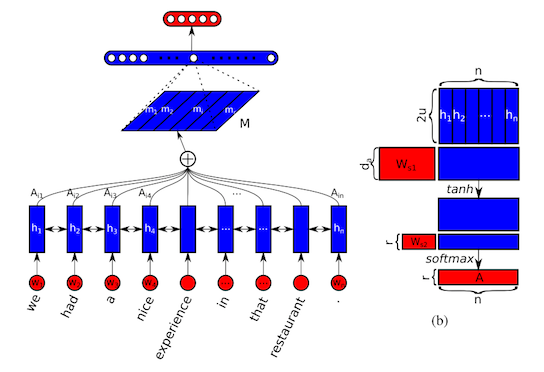
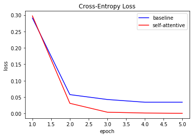
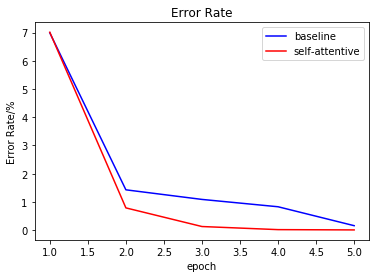
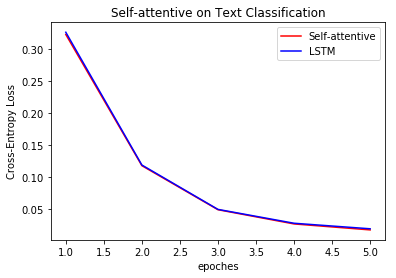
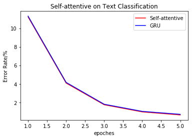

# Using self-attention on text classification

This is a self-attentive model implementation on [cntk](https://github.com/Microsoft/CNTK). This repo applies it on text classification.

### Prerequisites

- python 3.6
- cntk 2.4 for GPU
- numpy

### Dataset

The **toy dataset** used is ATIS, which is from cntk tutorial [202 Language Understanding with Recurrent Networks](https://cntk.ai/pythondocs/CNTK_202_Language_Understanding.html)

Download ATIS [training](https://github.com/Microsoft/CNTK/blob/release/2.5/Tutorials/SLUHandsOn/atis.train.ctf) and [test](https://github.com/Microsoft/CNTK/blob/release/2.5/Tutorials/SLUHandsOn/atis.test.ctf) dataset

Another **bigger dataset** is [AG's News Topic Classification Dataset](https://github.com/mhjabreel/CharCNN/tree/master/data/ag_news_csv)


### Model



This implementation is based on paper [A STRUCTURED SELF-ATTENTIVE SENTENCE EMBEDDING](https://arxiv.org/abs/1703.03130)

Inspired by tensorflow implementation in [this repo](https://github.com/flrngel/Self-Attentive-tensorflow)

- Baseline: embeded + stabilizer + bi-GRU(150 for each direction) + fc + fc
- Self-Attentive:  embeded + stabilizer + bi-GRU(150 for each direction) + **Self-Attentive** + fc + fc


### Result on toy dataset

Toy dataset train result






### Result on AG's 





### Run

```python
unzip ag_data.zip
unzip toy_data.zip
python selfAtt.py --lr 0.03 --dataset toy --max_epoch 5 --batch_size 60 --self_attention
```


### TODO

- Add penalty


